# 2. Arquitectura del Sistema

Este documento ofrece una visión general de la arquitectura del proyecto NAU, describiendo sus componentes principales, el flujo de datos y las decisiones de diseño clave que dan forma al sistema.

## 1. Visión General

El sistema NAU se basa en una **arquitectura desacoplada (headless)** que separa la gestión de contenido del frontend que lo presenta. Esta elección estratégica nos proporciona flexibilidad, rendimiento y una mejor experiencia tanto para editores como para desarrolladores.

Los tres pilares del sistema son:

1.  **Sanity.io (Backend / CMS):** Es nuestro centro de contenido. Funciona como un CMS headless donde los editores gestionan textos, imágenes y datos a través de una interfaz web amigable (`Sanity Studio`).
2.  **Astro (Frontend / Generador de Sitio):** Es el framework que construye el sitio web público. Astro consume los datos de Sanity, los transforma en páginas HTML optimizadas y gestiona la interactividad del lado del cliente.
3.  **Netlify (Plataforma de Despliegue / CI/CD):** Es el servicio que aloja nuestro sitio y automatiza el proceso de construcción y despliegue. Actúa como el pegamento que une nuestro código y nuestro contenido.

## 2. Diagrama de Arquitectura

El siguiente diagrama ilustra la relación y el flujo entre los componentes:

```mermaid
graph TD
    subgraph "Actores"
        A[👤 Visitante del Sitio]
        B[✍️ Editor de Contenido]
    end

    subgraph "Entorno de Desarrollo y Código"
        C(💻 Sanity Studio Local)
        D(💻 Sitio de Astro Local)
        E{🐙 Repositorio GitHub}
    end

    subgraph "Plataforma en la Nube"
        F(🚀 Sanity Content Lake) -- API (GROQ) --> G(🌐 Sitio Astro en Netlify)
        H(⚙️ Netlify Build) -- Despliega --> G
        I(🔌 Webhook de Sanity) -- Dispara --> H
    end

    B -- Usa --> C
    C -- Sincroniza con --> F
    E -- Actualiza código a --> H
    A -- Accede a --> G
    linkStyle 2 stroke:#f66,stroke-width:2px,color:red;
```

## 3. Flujo de Datos Detallado

El ciclo de vida del contenido y el código está diseñado para ser robusto y automatizado.

1.  **Gestión de Contenido:**
    -   Un editor modifica contenido en el **Sanity Studio** (ya sea localmente en `http://localhost:3333` o en la versión alojada en [sanity.studio](https://sanity.studio)).
    -   Los cambios se guardan en el **Sanity Content Lake**, la base de datos en la nube de Sanity.

2.  **Consumo de Contenido por Astro:**
    -   El sitio de Astro (`nau-astro-site`) se conecta a la API de Sanity usando el cliente oficial (`@sanity/astro`).
    -   Para obtener datos, Astro utiliza **GROQ**, el lenguaje de consulta de Sanity. Estas consultas se definen en el código (ej. dentro de `src/pages/encuentros.astro`) y permiten pedir exactamente los datos necesarios para cada página.
    -   Para las imágenes, utilizamos el componente `<SanityImage />` que se conecta con la CDN de Sanity para entregar imágenes optimizadas (formato, tamaño, calidad) según el dispositivo del usuario.

3.  **Proceso de Build y Despliegue (CI/CD):**
    -   **Disparador por Código:** Un `git push` a la rama `main` en GitHub automáticamente inicia un proceso de `build` en Netlify.
    -   **Disparador por Contenido:** Cuando un editor publica un cambio en Sanity, se dispara un **webhook** configurado que le notifica a Netlify que debe reconstruir el sitio. Esto asegura que el contenido se actualice en producción sin intervención de un desarrollador.
    -   Durante el `build`, Netlify ejecuta el comando `npm run build` en el directorio `nau-astro-site`. Astro obtiene todo el contenido de Sanity y genera un sitio web estático, rápido y optimizado.
    -   Finalmente, Netlify despliega este sitio estático en su red global (CDN) para una entrega de baja latencia a los visitantes.

## 4. Decisiones Clave de Arquitectura (ADRs)

Estas decisiones son el fundamento de nuestra arquitectura. El ADR completo se encuentra en [`docs/ADRs/001-eleccion-de-stack-astro-sanity.md`](./ADRs/001-eleccion-de-stack-astro-sanity.md).

### ADR-001: Elección de Astro como Framework Frontend

-   **Contexto:** Se necesitaba un sitio web de alto rendimiento, optimizado para SEO y con una excelente experiencia de desarrollador.
-   **Decisión:** Se eligió **Astro**.
-   **Justificación:** Su arquitectura de "islas" envía cero JavaScript por defecto, resultando en tiempos de carga muy rápidos. Su enfoque en el contenido y su flexibilidad lo hacían ideal para un proyecto basado en un CMS.

### ADR-002: Elección de Sanity.io como CMS Headless

-   **Contexto:** Se requería una forma flexible y escalable de gestionar contenido estructurado sin estar atado a un sistema monolítico.
-   **Decisión:** Se eligió **Sanity.io**.
-   **Justificación:** Su modelo de "contenido como código" (esquemas en JS), su potente lenguaje de consulta (GROQ), y su estudio personalizable nos dan control total y autonomía para los editores.
